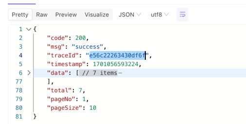

## 简介

`lemon-logger`是一个日志框架，统一规范了日志输出的格式，以及日志配置，主要扩展以下功能：

- 统一的日志格式格式输出，保持风格统一
- 对请求的参数，以及响应结果报文进行格式化日志输出
- 支持调用方法日志拦截存储
- 日志全链路跟踪

## 安装

1. 在项目的`pom.xml`中添加`parent`父依赖

```xml

<parent>
    <groupId>com.lemon.framework</groupId>
    <artifactId>lemon-dependencies</artifactId>
    <version>1.1.3.RELEASE</version>
</parent>
```

2. 在项目`pom.xml`添加`dependencies`引用

```xml
<dependency>
    <groupId>com.lemon.framework</groupId>
    <artifactId>lemon-logger-spring-boot-starter</artifactId>
</dependency>
```

## 如何使用

### 扩展配置

`Spring Boot`配置属性扩展如下：

```yaml
# Config
lemon:
  # 日志配置 `1.0.9.RELEASE` 以上版本支持
  logging:
    # 总开关, 为false将关闭日志功能, 默认开启
    enable: true
    # 输出日志内容级别, 默认：BASIC
    level: full
    # 日志打印最大字符长度（请求、响应参数），默认400个字符, 配置小于等于0不进行截取
    maximum-log-length: 400
    # 开启保存日志存储
    enable-repository: true
    # 系统全局默认日志存储器
    global-logging-repository: com.lemon.framework.logger.DefaultLoggingRepository

# Logger Config
logging:
file:
  path: logs
  name: lemon-example
level:
  root: info
  # 调整mapper目录为debug, 输出SQL语句
  com.lemon.example.infrastructure.persistent.broker.mapper: debug
logback:
  # 日志滚动策略
  rollingpolicy:
    max-history: 10
    max-file-size: 1GB
    total-size-cap: 12GB
```

### 日志输出 & 收集

框架采用`logback`规范了日志输出，系统默认将日志输出在当前应用目录`./logs`目录下，可选配置如下：

- `logging.file.name`配置输出日志文件名
- `logging.file.path`配置日志输出目录,
- `logging.level.root`配置日志输出级别
- `logging.pattern.console` 控制台输出日志格式
- `logging.pattern.file`文件输出日志格式
- `logging.logback.rollingpolicy.max-history` 保留的归档文件的最大数量, 默认10
- `logging.logback.rollingpolicy.max-file-size`活动文件的大小, 默认1GB
- `logging.logback.rollingpolicy.total-size-cap`控制所有归档日志文件的总大小, 默认10GB

> ⚠️由于Spring boot启动程序引导执行时，日志配置加载顺序是优先于`application.yml`配置文件的.
> 所以需要将以上属性在`bootstrap.yml`文件中进行配置，否则导致系统在加载时无法正常读取配置的值；
> >
> - [SpringCloud入门之常用的配置文件 application.yml和 bootstrap.yml区别](https://www.cnblogs.com/BlogNetSpace/p/8469033.html)

详细配置：[logback-spring.xml](hhttps://codeup.aliyun.com/66b98e63c3f44f74f4310473/framework/lemon-framework/-/blob/master/lemon-logger/src/main/resources/logback-spring.xml)

日志收集配置定义：

```json
{
  "app": "${SERVER_NAME:-}",
  "env": "${ENV:-}",
  "hostname": "${HOSTNAME:-}",
  "abbrev": "${git.commit.id.abbrev:-}",
  "time": "%date{\"yyyy-MM-dd'T'HH:mm:ss,SSS\"}",
  "level": "%level",
  "traceId": "%X{traceId:-}",
  "spanId": "%X{spanId:-}",
  "parentSpanId": "%X{parentId:-}",
  "clienteName": "%X{X-Client-Service-Name:-}",
  "pid": "${PID:-}",
  "thread": "%thread",
  "class": "%logger{40}",
  "line": "%line",
  "log": "%message",
  "exception": "%exception{full}"
}
```
- 配置说明：
  - `app` 服务应用名称
  - `env` 运行环境
  - `hostname` 运行主机
  - `abbrev` git common id
  - `time` 日志打印时间
  - `level` 日志级别
  - `traceId` 调用链路编号
  - `spanId` 单元编号（同一线程处理、与traceId一致）
  - `parentSpanId`上级链路编号，A调用了B服务，在B服务中传递A的单元编号
  - `clienteName`调用者服务名，可以查看接口是通过那个服务调用的
  - `pid`系统进程ID
  - `thread`运行线程
  - `class`日志输出的类
  - `line`代码行号
  - `log`日志详情
  - `exception`异常详情

- OpenSearch


### 调用拦截日志切面

对类、接口进行环绕切面，统一规范了请求参数，响应的日志输出。
在需要进行日志打印的`方法`或`类`上添加`@LogAnnotation`注解即可，注解的支持的扩展属性如下：

#### 示例代码
- 执行类处理
```java
@RestController
@RequestMapping("user")
@LogAnnotation
public class UserController {
    //...
}
```


- 执行方法处理
```java
@LogAnnotation(value = "保存用户信息")
@PostMapping("/save")
public Result save(@RequestBody UserReqVo userReqVo){
    //...
}
```

>⚠️方法定义`@LogAnnotation`注解属性内容优先于类定义注解属性

#### 格式化日志输出

日志框架对业务系统开放日志打印的接口,
需要业务方在系统中实现接口：`com.lemon.framework.logger.LoggingPrintProcessor`, 接口定义如下：

```java
/**
 * 日志打印处理器
 * {@link LogAnnotation } 处理前置、后置日志打印处理器， 默认处理器{@link DefaultLoggingPrintProcessor}
 *
 * @Author: siven
 */
public interface LoggingPrintProcessor {

    /**
     * 打印前置日志
     * 方法执行前
     *
     * @param logging
     */
    void printPreLogContent(LogAnnotation logAnnotation, Logging logging);

    /**
     * 打印后置日志
     * 方法执行完成后
     *
     * @param logging
     */
    void printPostLogContent(LogAnnotation logAnnotation, Logging logging);
}
```

系统提供默认日志打印处理类: `com.lemon.framework.logger.DefaultLoggingPrintProcessor`，
打印内容说明如下：

| 标签                     | 说明                                                                                              | 日志级别     |
|------------------------|-------------------------------------------------------------------------------------------------|----------|
| Request resource       | `HTTP请求` 请求的resource URI 以及请求方式 ，示例如下：<br>Request resource: POST -> /xxx/xxxx FROM:[lemon-agent-server] [方法描述] | BASIC    |
| description            | `非HTTP请求` 普通类调用描述信息： 通注解com.lemon.framework.logger.LogAnnotation#description， 未配置获取方法名称    | BASIC    |
| Processing time        | 请求接口到响应结果消耗时长(ms)                                                                               | BASIC    |
| http-request-parameter | `HTTP请求` form data 参数                                                                           | REQUEST  |
| http-request-body      | `HTTP请求` Request Body参数                                                                         | REQUEST  |
| method-parameter       | `非HTTP请求` 普通类调用入参JSON内容, KEY为参数变量, value为对象JSON序列化值                                             | REQUEST  |
| Response result        | 方法响应参数JSON                                                                                      | RESPONSE |
| http-request-headers   | `HTTP请求` Http request Headers                                                                   | HEADERS  |

日志级别可通过配置调整：`lemon.logging.level=FULL`, 系统默认`BASIC`,可选配置说明如下：
- `NONE` 关闭日志打印
- `BASIC` 请求方法打印
- `REQUEST` 请求参数打印
- `RESPONSE` 响应参数打印
- `HEADERS` 打印Headers
- `FULL` 全部开启

>⚠️由于请求参数、响应参数过长，导致日志输出内容过多，系统提供配置可调整打印参数日志最大长度 `lemon.logging.maximum-log-length=400`，默认打印400个字符，可根据实际场景灵活调整（小于等于0打印全部内容）

### 日志存储器

日志框架对业务系统开放日志存储的接口, 需要业务方在系统中实现接口：`com.lemon.framework.logger.LoggingRepository`,
接口定义如下：

```java
package com.lemon.framework.logger;

/**
 * 日志存储器<br>
 * <br>
 *
 * @author siven
 * @Date 2023-11-25
 */
public interface LoggingRepository {

    /**
     * 提供保存日志的接口
     *
     * @param logging
     */
    void logger(Logging logging);
}

```

> ⚠️注意：
>
> 1. `Logging`为日志对象，主要包含了调用`Resource`
     资源的属性信息，具体详细见 ››[代码](hhttps://codeup.aliyun.com/66b98e63c3f44f74f4310473/framework/lemon-framework/-/blob/master/lemon-logger/src/main/java/com/lemon/framework/logger/Logging.java)
> 2. 业务系统实现接口后, 需要在`application.yml`配置开启保存日志存储(`lemon.logging.enable-repository=true`)

### 日志全链路跟踪

日志全链路跟踪基于`spring-cloud-starter-sleuth`实现，支持OpenFeign、RestTemplate、Web、MQ(kafka\rabbitMQ..)等 请求全链路日志跟踪。

- 调用链路`traceId`、`spanId`、`parentSpanId`关系说明：


- Result响应结果输出`traceId`



- 控制台日志输出


- OpenSearch


---

> ⚠️注意： 使用多线程场景下， traceId 多线程必须遵循以下方式实现(任选其一)

```java

@Component
public class TraceIdTest {

    //方式一, 申明注入ThreadPoolTaskExecutor线程池对象
    @Autowired
    ThreadPoolTaskExecutor threadPoolTaskExecutor;

    public void testExecutor() {
        threadPoolTaskExecutor.execute(() -> {
            //TODO ..
        });
    }


    //方式二（推荐）： 使用Spring @Async
    @Async
    public void testAsync() {
        //todo ...
    }
}
```